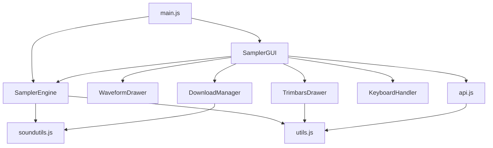

# Documentation Technique - Audio Sampler Web

## Architecture Globale

### Pattern de Conception

Le projet suit le **pattern de séparation Engine/GUI** (aussi appelé Model-View ou Headless Architecture) :

- **SamplerEngine** : Modèle métier (Business Logic)
  - Gère l'audio (AudioContext, AudioBuffers)
  - État des samples
  - Lecture et contrôle
  - Totalement indépendant de l'UI

- **SamplerGUI** : Vue/Contrôleur
  - Interface utilisateur
  - Événements utilisateur
  - Visualisation
  - Dépend de SamplerEngine

### Avantages de cette Architecture

1. **Testabilité** : Le moteur peut être testé sans interface
2. **Réutilisabilité** : Le moteur peut être utilisé dans d'autres contextes
3. **Maintenabilité** : Séparation claire des responsabilités
4. **Flexibilité** : Plusieurs interfaces peuvent utiliser le même moteur

---

## Modules JavaScript

### Structure Modulaire ES6

```
main.js
├── SamplerEngine.js
│   ├── soundutils.js
│   └── utils.js
└── SamplerGUI.js
    ├── WaveformDrawer.js
    ├── TrimbarsDrawer.js
    │   └── utils.js
    ├── DownloadManager.js
    │   └── soundutils.js
    ├── KeyboardHandler.js
    └── api.js
        └── utils.js
```

### Dépendances entre Modules



---

## Web Audio API - Flux de Données

### 1. Chargement et Décodage

```
Fichier WAV sur serveur
    ↓ (fetch)
ArrayBuffer en mémoire
    ↓ (decodeAudioData)
AudioBuffer décodé
    ↓ (stockage)
Sample object
```

### 2. Lecture Audio

```
AudioBuffer
    ↓ (createBufferSource)
AudioBufferSourceNode
    ↓ (connect)
AudioDestinationNode (speakers)
    ↓
Son audible
```

### 3. Graphe Audio Actuel

```
[AudioBuffer] → [AudioBufferSourceNode] → [AudioContext.destination] → 🔊
```

### 4. Graphe Audio Extensible (Futur)

```
[AudioBuffer] → [AudioBufferSourceNode] 
    ↓
[GainNode] → [FilterNode] → [ReverbNode] → [AudioContext.destination] → 🔊
```

---

## Gestion des Samples

### Objet Sample

```javascript
class Sample {
    url: string              // URL source
    name: string             // Nom du sample
    audioBuffer: AudioBuffer // Buffer décodé
    blob: Blob              // Fichier téléchargé
    isLoaded: boolean       // État de chargement
    isDownloaded: boolean   // État de téléchargement
    error: string           // Message d'erreur
    leftTrimSeconds: number // Position trim gauche
    rightTrimSeconds: number // Position trim droite
}
```

### Cycle de Vie d'un Sample

```
1. CRÉATION
   new Sample(url, name)
   ↓
2. TÉLÉCHARGEMENT
   DownloadManager.downloadFile(url)
   → blob stocké
   ↓
3. DÉCODAGE
   audioContext.decodeAudioData(arrayBuffer)
   → audioBuffer stocké
   ↓
4. CONFIGURATION
   setTrimPositions(left, right)
   ↓
5. LECTURE
   playSample(index, startTime, endTime)
   ↓
6. SAUVEGARDE (optionnelle)
   saveBlobToFile(blob, filename)
```

---

## Visualisation - Canvas

### WaveformDrawer

**Principe** : Réduction des données audio pour visualisation

```
AudioBuffer (ex: 44100 samples/s × durée)
    ↓ (calculatePeaks)
Tableau de pics (1 pic par pixel)
    ↓ (draw)
Canvas avec waveform
```

**Algorithme de calcul des pics :**

```javascript
samplesPerPixel = totalSamples / canvasWidth

Pour chaque pixel x:
    start = x * samplesPerPixel
    end = start + samplesPerPixel
    
    Pour chaque sample dans [start, end]:
        min = Math.min(min, sample)
        max = Math.max(max, sample)
    
    peaks[x] = { min, max }
```

### TrimbarsDrawer

**Principe** : Overlay transparent au-dessus de la waveform

```
Canvas waveform (fond)
    +
Canvas trimbars (overlay transparent)
    ↓
Zones sombres en dehors des barres
Barres rouges draggables
```

**Conversion pixel ↔ secondes :**

```javascript
// Pixel vers secondes
seconds = (pixel / canvasWidth) × duration

// Secondes vers pixel
pixel = (seconds / duration) × canvasWidth
```

---

## Téléchargement avec Progression

### DownloadManager

**Principe** : ReadableStream pour suivi de progression

```javascript
fetch(url)
    ↓
response.body.getReader()
    ↓
while (!done) {
    { value, done } = reader.read()
    receivedLength += value.length
    progress = (receivedLength / total) × 100
    onProgress(progress)
}
    ↓
Blob(chunks)
```

### Chargement Parallèle avec Promise.allSettled

```javascript
// Pas Promise.all (s'arrête à la première erreur)
// Mais Promise.allSettled (continue malgré les erreurs)

Promise.allSettled([
    downloadFile(url1),
    downloadFile(url2),
    downloadFile(url3)
])
↓
[
    { status: 'fulfilled', value: blob1 },
    { status: 'rejected', reason: error },
    { status: 'fulfilled', value: blob3 }
]
```

---

## API REST

### Endpoints

#### GET /api/presets

Retourne tous les presets :

```json
[
    {
        "name": "808",
        "type": "Drumkit",
        "isFactoryPresets": true,
        "samples": [
            {
                "url": "./808/Kick 808X.wav",
                "name": "Kick"
            }
        ]
    }
]
```

#### GET /presets/:folder/:file

Sert les fichiers audio statiques.

**Exemple :**
```
GET /presets/808/Kick%20808X.wav
→ Fichier WAV en streaming
```

### Construction des URLs

```javascript
URL relative dans preset : "./808/Kick 808X.wav"
    ↓ (buildAudioURL)
URL absolue : "http://localhost:3000/presets/808/Kick 808X.wav"
    ↓ (encodeURI)
URL encodée : "http://localhost:3000/presets/808/Kick%20808X.wav"
```

---

## Ordre des Pads

### Spécification : Bas en Haut, Gauche à Droite

```
Samples dans preset: [0, 1, 2, 3, 4, 5, ..., 15]

Grille de pads (vue utilisateur):
┌────┬────┬────┬────┐
│ 12 │ 13 │ 14 │ 15 │  ← Ligne 4 (haut)
├────┼────┼────┼────┤
│  8 │  9 │ 10 │ 11 │  ← Ligne 3
├────┼────┼────┼────┤
│  4 │  5 │  6 │  7 │  ← Ligne 2
├────┼────┼────┼────┤
│  0 │  1 │  2 │  3 │  ← Ligne 1 (bas)
└────┴────┴────┴────┘
```

### Implémentation

```javascript
// Création des pads en ordre spécial
for (let row = 3; row >= 0; row--) {      // De bas en haut
    for (let col = 0; col < 4; col++) {   // De gauche à droite
        const padIndex = (3 - row) * 4 + col;
        createPad(padIndex);
    }
}
```

---

## Gestion des Événements

### Event Flow

```
User Input
    ↓
DOM Events
    ↓
Event Handlers (SamplerGUI ou KeyboardHandler)
    ↓
Actions (selectPad, playSample, etc.)
    ↓
Engine Methods (SamplerEngine)
    ↓
Web Audio API
    ↓
Sound Output 🔊
```

### Principaux Événements

| Source | Event | Handler | Action |
|--------|-------|---------|--------|
| Pad | click | handlePadClick | Sélectionner + Jouer |
| Bouton Play | click | playSample | Jouer sample actuel |
| Bouton Save | click | saveSample | Sauvegarder fichier |
| Bouton Load All | click | loadAllSamples | Télécharger tous |
| Select Preset | change | handlePresetSelection | Changer preset |
| Clavier | keydown | KeyboardHandler | Contrôle clavier |
| Trim Bar | mousedown/move/up | TrimbarsDrawer | Ajuster trim |

---

## Performances et Optimisations

### Mémoire

- **AudioBuffers** : Décodés une fois, réutilisés
- **Blobs** : Conservés pour sauvegarde ultérieure
- **Canvas** : Waveform calculée une fois par sample

### Calculs

- **Waveform** : Réduction des samples (1 pic par pixel)
- **Trim bars** : Calcul pixel/secondes à la demande
- **Chargement** : Parallèle avec Promise.allSettled

### Réseau

- **Téléchargement** : Streaming avec progression
- **Caching** : DownloadManager garde les blobs en mémoire
- **Serveur** : Express avec support ETag et cache

---

## Extensibilité

### Ajouter des Effets Audio

```javascript
// Dans SamplerEngine.js
playSample(index, startTime, endTime) {
    const source = this.audioContext.createBufferSource();
    source.buffer = sample.audioBuffer;
    
    // AJOUT D'EFFETS
    const gainNode = this.audioContext.createGain();
    const filterNode = this.audioContext.createBiquadFilter();
    
    // Graphe : source → gain → filter → destination
    source.connect(gainNode);
    gainNode.connect(filterNode);
    filterNode.connect(this.audioContext.destination);
    
    source.start(0, startTime, endTime - startTime);
}
```

### Ajouter le Support MIDI

```javascript
// Nouveau module : MIDIHandler.js
export class MIDIHandler {
    async init() {
        const midiAccess = await navigator.requestMIDIAccess();
        midiAccess.inputs.forEach(input => {
            input.onmidimessage = this.handleMIDIMessage.bind(this);
        });
    }
    
    handleMIDIMessage(message) {
        const [status, note, velocity] = message.data;
        if (status === 144) { // Note On
            const padIndex = this.noteMapping[note];
            this.gui.playSample(padIndex);
        }
    }
}
```

### Ajouter l'Enregistrement

```javascript
// Nouveau module : Recorder.js
export class Recorder {
    constructor(audioContext) {
        this.context = audioContext;
        this.recorder = null;
    }
    
    startRecording() {
        const dest = this.context.createMediaStreamDestination();
        this.recorder = new MediaRecorder(dest.stream);
        // ... logique d'enregistrement
    }
}
```

---

## Tests et Débogage

### Mode Headless

Tester le moteur sans interface :

```javascript
import { SamplerEngine } from './SamplerEngine.js';

const engine = new SamplerEngine();
await engine.init();
await engine.loadSample(url, name);
engine.playSample(0);
```

### Console Debugging

Variables globales exposées :
```javascript
window.samplerEngine  // Instance du moteur
window.samplerGUI     // Instance de l'interface
window.testHeadless   // Fonction de test
```

### Logs de Débogage

Tous les modules loggent leurs actions importantes :
```javascript
console.log('✓ Sample chargé:', name);
console.error('✗ Erreur:', error);
console.warn('⚠️  Attention:', warning);
```

---

## Bonnes Pratiques Implémentées

### Code

- ✅ Modules ES6 (import/export)
- ✅ Classes et POO
- ✅ Async/await pour le code asynchrone
- ✅ Gestion d'erreurs avec try/catch
- ✅ JSDoc pour la documentation
- ✅ Noms de variables explicites

### Architecture

- ✅ Séparation Engine/GUI
- ✅ Single Responsibility Principle
- ✅ Composition over Inheritance
- ✅ Dependency Injection
- ✅ Event-driven architecture

### Audio

- ✅ One-shot AudioBufferSourceNode (fire and forget)
- ✅ Gestion du contexte suspendu (autoplay policy)
- ✅ Décodage audio asynchrone
- ✅ Trim bars avec précision au sample près

### UX/UI

- ✅ Feedback visuel pour toutes les actions
- ✅ Barres de progression
- ✅ États de chargement
- ✅ Messages d'erreur clairs
- ✅ Animations fluides
- ✅ Support clavier
- ✅ Accessibilité (focus visible)

---

## Pistes d'Amélioration Futures

### Fonctionnalités

- [ ] Support MIDI
- [ ] Effets audio (reverb, delay, filter, etc.)
- [ ] Enregistrement de sessions
- [ ] Export de patterns
- [ ] Mode multi-pistes
- [ ] Séquenceur intégré
- [ ] Vélocité (volume selon la force du clic)
- [ ] Pitch shift (changer la hauteur)

### Technique

- [ ] Service Worker pour cache offline
- [ ] IndexedDB pour persistance
- [ ] WebAssembly pour traitements audio complexes
- [ ] Web Workers pour calculs lourds (waveform)
- [ ] Optimisation mémoire (lazy loading)
- [ ] Tests unitaires (Jest, Mocha)
- [ ] CI/CD

### UX

- [ ] Mode sombre/clair
- [ ] Thèmes personnalisables
- [ ] Raccourcis clavier configurables
- [ ] Glisser-déposer de fichiers
- [ ] Éditeur de waveform
- [ ] Visualiseur de spectre (FFT)
- [ ] Métronome intégré

---

## Conclusion

Ce projet démontre une implémentation complète et professionnelle d'un sampler audio web, suivant les meilleures pratiques de développement web moderne et d'architecture logicielle.

L'architecture modulaire et la séparation Engine/GUI permettent une grande flexibilité pour les futures évolutions.

